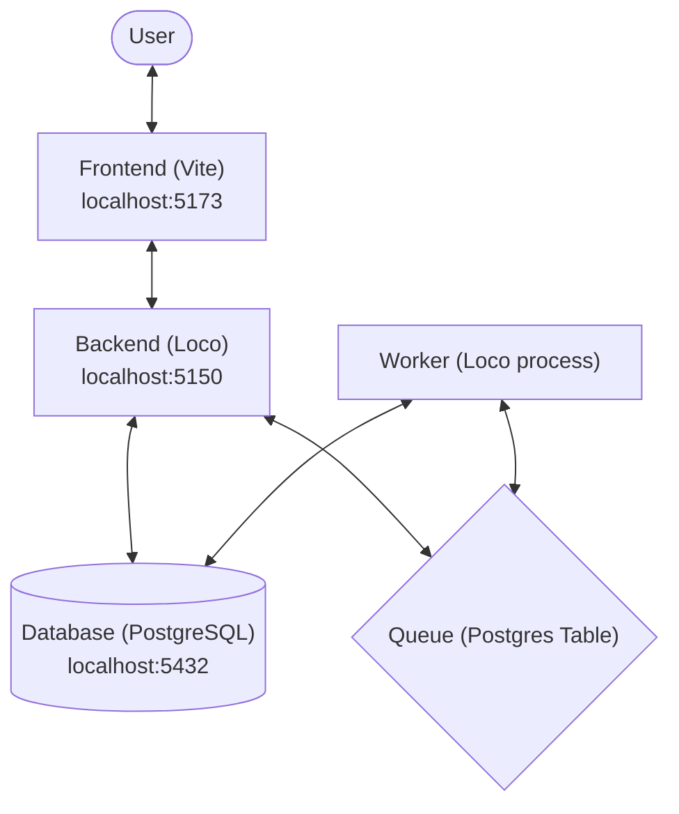
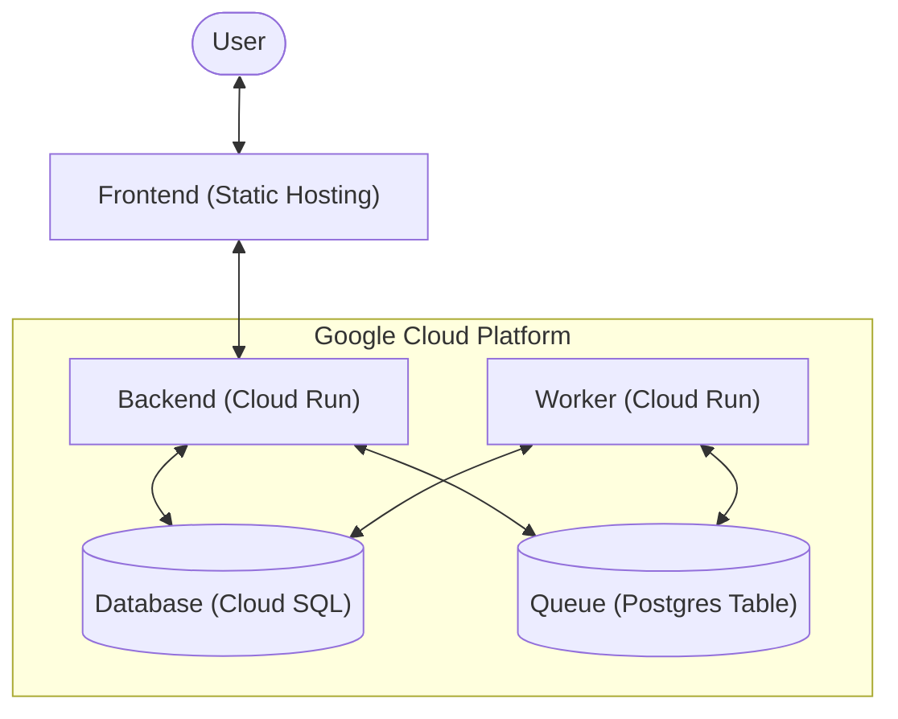

# Welcome to Loco :train:

[Loco](https://loco.rs) is a web and API framework running on Rust.

This is the **SaaS starter** which includes a `User` model and authentication based on JWT.
It also include configuration sections that help you pick either a frontend or a server-side template set up for your fullstack server.


## Quick Start

```sh
cargo loco start
```

```sh
$ cargo loco start
Finished dev [unoptimized + debuginfo] target(s) in 21.63s
    Running `target/debug/myapp start`

    :
    :
    :

controller/app_routes.rs:203: [Middleware] Adding log trace id

                      ▄     ▀
                                 ▀  ▄
                  ▄       ▀     ▄  ▄ ▄▀
                                    ▄ ▀▄▄
                        ▄     ▀    ▀  ▀▄▀█▄
                                          ▀█▄
▄▄▄▄▄▄▄  ▄▄▄▄▄▄▄▄▄   ▄▄▄▄▄▄▄▄▄▄▄ ▄▄▄▄▄▄▄▄▄ ▀▀█
 ██████  █████   ███ █████   ███ █████   ███ ▀█
 ██████  █████   ███ █████   ▀▀▀ █████   ███ ▄█▄
 ██████  █████   ███ █████       █████   ███ ████▄
 ██████  █████   ███ █████   ▄▄▄ █████   ███ █████
 ██████  █████   ███  ████   ███ █████   ███ ████▀
   ▀▀▀██▄ ▀▀▀▀▀▀▀▀▀▀  ▀▀▀▀▀▀▀▀▀▀  ▀▀▀▀▀▀▀▀▀▀ ██▀
       ▀▀▀▀▀▀▀▀▀▀▀▀▀▀▀▀▀▀▀▀▀▀▀▀▀▀▀▀▀▀▀▀▀▀▀▀▀▀▀
                https://loco.rs

environment: development
   database: automigrate
     logger: debug
compilation: debug
      modes: server

listening on http://localhost:5150
```


## System Architecture

### Development Setup
In development, the system runs locally with the frontend and backend as separate processes.



### Production Setup
In production, the system is deployed to Google Cloud Platform using Cloud Run and Cloud SQL.



## Full Stack Serving

You can check your [configuration](config/development.yaml) to pick either frontend setup or server-side rendered template, and activate the relevant configuration sections.


## Blob Storage

The system supports both local filesystem and Google Cloud Storage (GCS) for storing binary large objects (blobs).

### Configuration

-   **Local Storage (Default)**: Used when no specific configuration is provided. Files are stored in the `storage` directory in the project root.
-   **Google Cloud Storage**: To enable GCS, set the following environment variable:
    -   `GOOGLE_CLOUD_BUCKET`: The name of the GCS bucket to use.
    -   `GOOGLE_APPLICATION_CREDENTIALS`: (Optional) Path to the service account JSON key. If not provided, it attempts to use the default environment credentials.

## Getting help

Check out [a quick tour](https://loco.rs/docs/getting-started/tour/) or [the complete guide](https://loco.rs/docs/getting-started/guide/).
